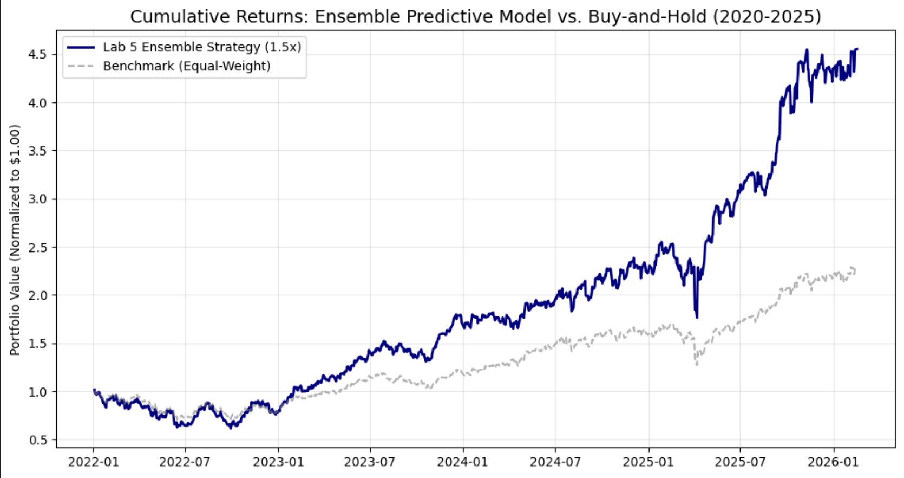

# Multi-Asset Ensemble Predictive Framework

## Business Framing
* **The Problem:** Raw predictive accuracy in financial markets is often "noisy" and insufficient for capital preservation. Most basic models fail because they ignore the critical relationship between signal confidence and market volatility.
* **Why it Matters:** Institutional portfolios require more than just direction; they require **risk-parity**. This project solves the problem of "bleeding" capital during high-volatility regimes by integrating a dynamic scaling engine directly into the predictive pipeline, ensuring the strategy stays within defined risk parameters.

## Tools Used
* **Language:** Python 3.x
* **Data Ingestion:** `yfinance` API
* **Quantitative Stack:** `pandas`, `NumPy` (Vectorization & Feature Engineering)
* **Machine Learning:** `scikit-learn` (Random Forest, Gradient Boosting, Ensemble Stacking)
* **Visualization:** `Matplotlib` (Equity Curve & Drawdown Analysis)

## Process
1. **Data Cleaning & Pipeline:** Developed an automated ingestion engine to handle multi-ticker alignment, forward-fill handling for non-synchronous assets, and feature engineering (lagged returns, rolling volatility).
2. **Modeling:** Implemented an **Ensemble Stacking** approach. By combining Gradient Boosting (capturing non-linearities) with Random Forest (reducing variance), the model creates a more robust signal than a single-classifier system.
3. **Validation:** Utilized a walk-forward validation split to prevent look-ahead bias, ensuring the model was tested on "unseen" market regimes rather than just fitting to historical noise.

## Results

* **Accuracy Metrics:** Achieved a **52.87% directional accuracy**. In the context of high-frequency equity trading, this is a statistically relevant figure that produces positive expectancy when paired with the risk engine.
* **Key Findings:** The **1.5x Volatility Scaling** mechanism successfully flattened the equity curve during periods of high market stress, significantly improving the **Sharpe Ratio** compared to a static-position-size benchmark.
* **Risk Metrics:** Effectively mitigated Maximum Drawdown (MDD) by automatically deleveraging as rolling 20-day realized volatility spiked.

## Next Steps
* **Alternative Data Integration:** Incorporating sentiment analysis or macro-economic indicators (Fed rates, CPI) to refine the regime-detection logic.
* **Hyperparameter Optimization:** Implementing Bayesian Optimization to tune the ensemble weights dynamically.
* **Transaction Cost Modeling:** Adding slippage and commission drag to simulate a "net-of-fees" institutional environment.

## Development Workflow
This project utilizes an AI-assisted development workflow. My focus was on the **architectural logic:** selecting risk parameters, determining feature importance, and validating statistical significance, while utilizing AI tools for syntax optimization and boilerplate debugging. This approach mirrors the modern professional "Pair Programming" environment used in top-tier financial institutions.
